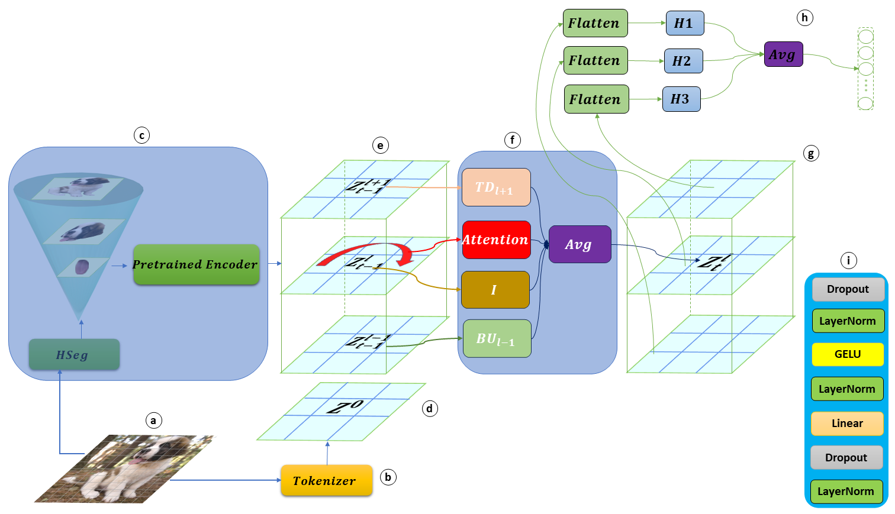

# FedPartWhole: Federated domain generalization via consistent part-whole hierarchies
Official code for "FedPartWhole: Federated domain generalization via consistent part-whole hierarchies" ([Ahmed Radwan](https://scholar.google.com/citations?user=LCz8YhMAAAAJ&hl=en), [Mohamed S. Shehata](https://scholar.google.com/citations?hl=en&user=i9PpMVkAAAAJ)) \[[arxiv](https://arxiv.org/abs/2407.14792v1)\]

## Requirements Setup

From the main directory run:

``pipenv install``

to install the required packages

## SAM Setup

``pip install git+https://github.com/facebookresearch/segment-anything.git``

Install SAM which will be used in the pipeline to generate initializations for our CCNet

## Dataset

We performed our experiments on two popular benchamrks for domain generalization.
1- PACS: [url](https://github.com/MachineLearning2020/Homework3-PACS/tree/master/PACS)
2- VLCS: [url](https://github.com/belaalb/G2DM?tab=readme-ov-file#download-vlcs)

The datasets should be placed in the datasets dir which is under the root directory. For each dataset dir, we will have two subdirs first is raw_images and the second is emb for the embeddings. To generate the embeddings refer to our previous work [here](https://github.com/AhmedMostafaSoliman/distill-part-whole) and follow the sections on generating SAM masks, then generating the embeddings.

## Running Experiments
Examples of running training and viewing the testing results are available in ``utils/run_exps``
For example, to run the fedaverage algorithm using our CCNet on the PACS benchmark, where the test domain is p, run:

``python algorithms/fedavg/train_pacs.py --flagfile configs/config_PACS_ccnet.cfg --model "ccnet" --test_domain p --comment "fed avg, ccnet(3heads), pacs on p"``

to run the same algorithm but now using the pretrained mobilenet as the backbone instead, run:
``python algorithms/fedavg/train_pacs.py --model "mobilenetv1" --pretrain --test_domain p --comment "fed avg, mobilenetv1 pretrained, pacs on p"``

## Citing

    @article{radwan2024fedpartwhole,
    title={FedPartWhole: Federated domain generalization via consistent part-whole hierarchies},
    author={Radwan, Ahmed and Shehata, Mohamed S},
    journal={arXiv preprint arXiv:2407.14792},
    year={2024}
    }

## Credits

the code rebuilds on the work and borrows from the code bases of:

- Distill Part Whole [link](https://github.com/AhmedMostafaSoliman/distill-part-whole)

Also the code and project structure is borrowed from:

- FedDG-GA [link](https://github.com/MediaBrain-SJTU/FedDG-GA)
